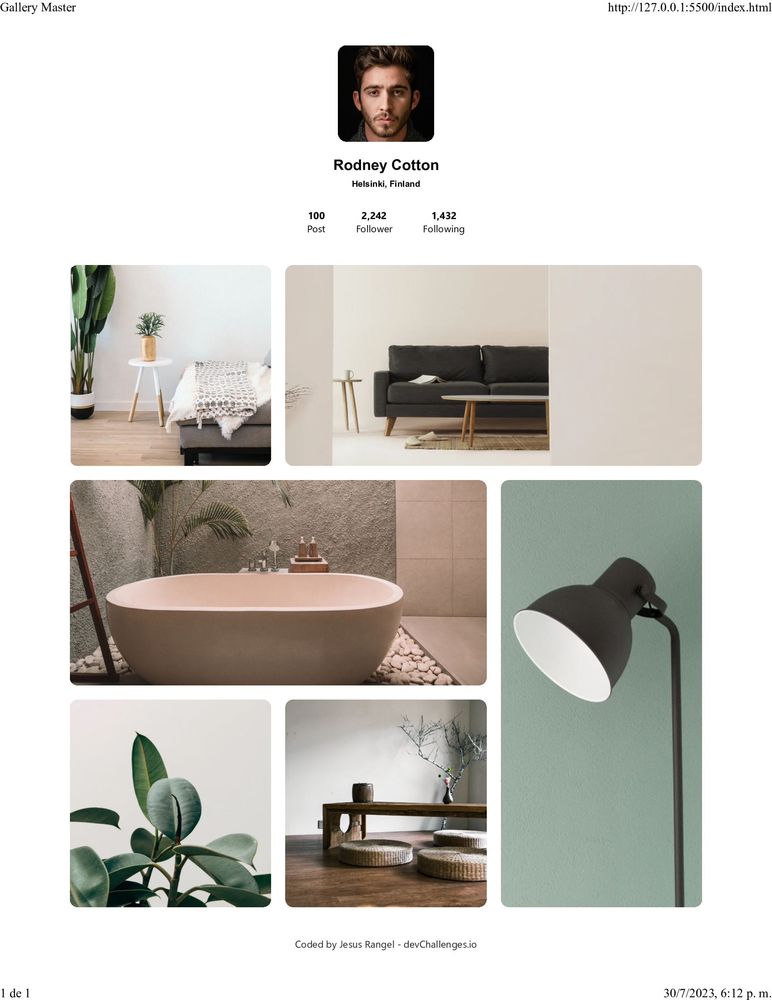

<!-- Please update value in the {}  -->

<h1 align="center">{My gallery master by truelegion44}</h1>

   Solution for a challenge from  <a href="http://devchallenges.io" target="_blank">Devchallenges.io</a>.

  <h3>
    <a href="https://{github.com/jerangel1/My-Gallery-Challenge}">
      Demo
    </a>
     | 
    <a href="https://{127.0.0.1:5500/index.html}">
      Solution
    </a>
     | 
    <a href="https://devchallenges.io/challenges/gcbWLxG6wdennelX7b8I">
      Challenge
    </a>
  </h3>

<!-- TABLE OF CONTENTS -->

## Table of Contents

- [Overview](#overview)
  - [Built With](#built-with)
- [Features](#features)
- [Contact](#contact)
- [Acknowledgements](#acknowledgements)

<!-- OVERVIEW -->

## Overview

Introduce your projects by taking a screenshot or a gif. Try to tell visitors a story about your project by answering:

- Where can I see your demo?
You can check out the demo of this project at the following link: Demo Link

- What was your experience?
Building this project was an amazing experience. I had the opportunity to work with various technologies and frameworks, which helped me improve my web development skills.

- What have you learned/improved?
Throughout the project, I learned to effectively use HTML, CSS, and Bootstrap to create a responsive and visually appealing website. I also enhanced my understanding of layout design and styling techniques.

#- Any advice?
My advice for fellow developers is to never stop learning and exploring new technologies. Embrace challenges and keep striving for improvement. Collaborate with others and seek feedback to further enhance your skills. The learning journey is endless, and every step you take will lead you to growth and success. #ThisIsTheWay 

This project was built using the following major frameworks:

- [HTML](https://www.w3.org/TR/html52/)
- [CSS](https://www.w3.org/Style/CSS/)
- [Bootstrap](https://getbootstrap.com/)

## Features

<!-- List the features of your application or follow the template. Don't share the figma file here :) -->

This application/site was created as a submission to a [DevChallenges](https://devchallenges.io/challenges) challenge. The [challenge](https://devchallenges.io/challenges/gcbWLxG6wdennelX7b8I) was to build an application to complete the given user stories.

## Acknowledgements

<!-- This section should list any articles or add-ons/plugins that helps you to complete the project. This is optional but it will help you in the future. For exmpale -->

- [Steps to replicate a design with only HTML and CSS](https://devchallenges-blogs.web.app/how-to-replicate-design/)
- [Node.js](https://nodejs.org/)
- [Marked - a markdown parser](https://github.com/chjj/marked)

## Contact

- Linkedin [Nathaniel](https://www.linkedin.com/in/nathaniel-chebem-646504284/)
- GitHub [@truelegion44](https://github.com/truelegion44)

